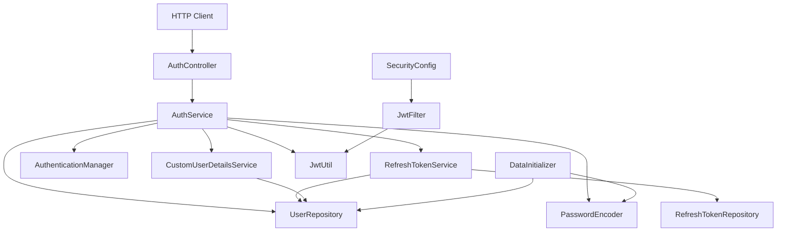
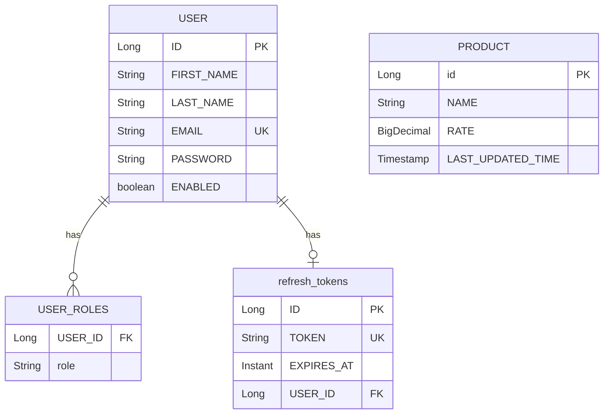

# Project Architecture

## Technology Stack

- Java: 25
- Build: Gradle
- Framework: Spring Boot 4.0.6
- Web: Spring MVC via `spring-boot-starter-web`
- Security: Spring Security with stateless JWT authentication
- Persistence: Spring Data JPA with Oracle JDBC
- Validation: Jakarta Bean Validation
- Token library: JJWT 0.13.0
- Boilerplate reduction: Lombok

## Package Layout

```text
com.oi.app.organoindia
├── OrganoindiaApplication.java
├── config
│   ├── DataInitializer.java
│   └── SecurityConfig.java
├── controller
│   └── AuthController.java
├── dto
│   ├── AuthResponse.java
│   ├── LoginRequest.java
│   ├── RefreshRequest.java
│   └── RegisterRequest.java
├── exception
│   ├── AuthEntryPoint.java
│   ├── CustomAccessDeniedHandler.java
│   └── GlobalExceptionHandler.java
├── model
│   ├── Product.java
│   ├── RefreshToken.java
│   ├── Role.java
│   └── User.java
├── repository
│   ├── RefreshTokenRepository.java
│   └── UserRepository.java
├── security
│   ├── CustomUserDetailsService.java
│   ├── JwtFilter.java
│   └── JwtUtil.java
└── service
    ├── AuthService.java
    ├── ProductService.java
    └── RefreshTokenService.java
```

## Layer Responsibilities

| Layer | Classes | Responsibility |
| --- | --- | --- |
| Bootstrap | `OrganoindiaApplication` | Starts the Spring Boot application context. |
| Configuration | `SecurityConfig`, `DataInitializer` | Configures security beans and creates an admin user at startup. |
| Controllers | `AuthController` | Receives HTTP auth requests and delegates business logic to services. |
| Services | `AuthService`, `RefreshTokenService`, `ProductService` | Own auth workflow, refresh token lifecycle, and product service authorization examples. |
| Security | `JwtFilter`, `JwtUtil`, `CustomUserDetailsService` | Validates JWTs, builds Spring Security users, and signs/parses tokens. |
| Persistence | `UserRepository`, `RefreshTokenRepository` | Provides database access through Spring Data JPA. |
| Models | `User`, `RefreshToken`, `Product`, `Role` | Define persisted domain entities and role enum. |
| DTOs | `LoginRequest`, `RegisterRequest`, `RefreshRequest`, `AuthResponse` | Define request and response payload shapes. |
| Exceptions | `GlobalExceptionHandler`, `AuthEntryPoint`, `CustomAccessDeniedHandler` | Convert failures to JSON HTTP responses. |

## Runtime Component Dependency Graph



## Persistence Model



## Security Model

Security is configured in `SecurityConfig`.

Route rules:

| Request | Access |
| --- | --- |
| `/api/auth/**` | Public |
| `GET /api/products/**` | Public |
| `GET /api/categories/**` | Public |
| `POST /api/products/**` | `ROLE_ADMIN` |
| `PUT /api/products/**` | `ROLE_ADMIN` |
| `DELETE /api/products/**` | `ROLE_ADMIN` |
| `/api/admin/**` | `ROLE_ADMIN` |
| Any other request | Authenticated user |

Additional security behavior:

- CSRF is disabled because the app uses stateless JWT auth.
- Sessions are stateless through `SessionCreationPolicy.STATELESS`.
- `JwtFilter` runs before `UsernamePasswordAuthenticationFilter`.
- HTTP Strict Transport Security is enabled.
- Frame options are denied.
- Content Security Policy is set to `default-src 'self'`.
- Method security is enabled through `@EnableMethodSecurity`.

## Token Model

The app uses two token types:

- Access token: a signed JWT generated by `JwtUtil.generate(UserDetails)`.
- Refresh token: a UUID stored in the database by `RefreshTokenService.create(String email)`.

Access token contents:

- JWT subject: user email.
- JWT claim `roles`: list of Spring Security authority names such as `ROLE_ADMIN` or `ROLE_CUSTOMER`.
- Issued-at timestamp.
- Expiration timestamp based on `app.jwt.expiry-minutes`, defaulting to 20 minutes.

Refresh token behavior:

- Stored in `refresh_tokens`.
- One refresh token per user.
- Creating a refresh token deletes the user's previous refresh token.
- Expiration is based on `app.jwt.refresh-expiry-days`, defaulting to 7 days.
- Refresh tokens are reused during access-token refresh rather than rotated.

## Configuration Notes

`src/main/resources/application.properties` defines:

- Oracle datasource URL, username, password, driver.
- Hikari connection pool sizing.
- JPA DDL disabled.
- Oracle Hibernate dialect.
- Spring Data REST base path `/api`.

Required values referenced by code but not present in the committed properties file:

- `app.jwt.secret`: Base64-encoded signing secret for `JwtUtil`.
- `app.admin.email`: Admin email used by `DataInitializer`.
- `app.admin.password`: Admin password used by `DataInitializer`.

