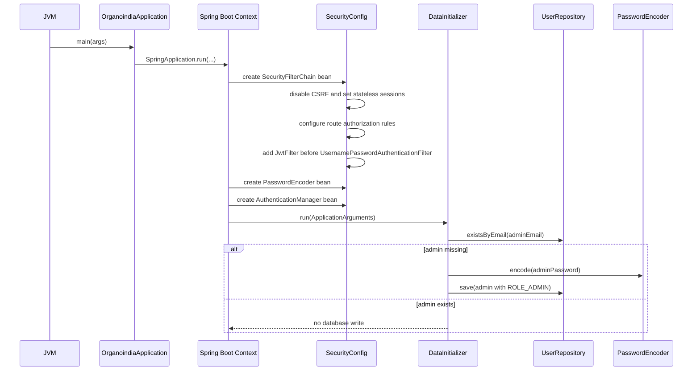
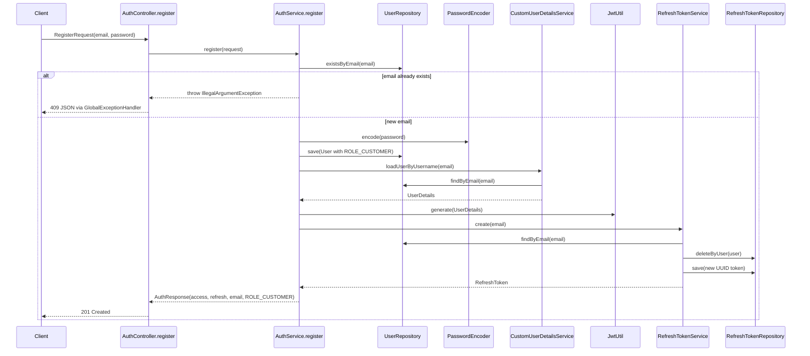
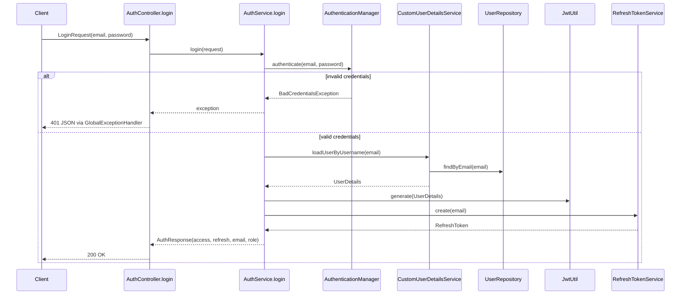
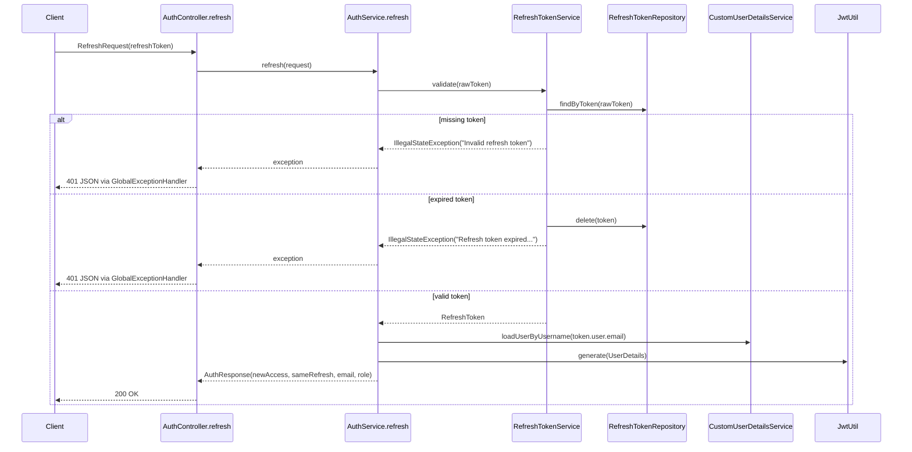
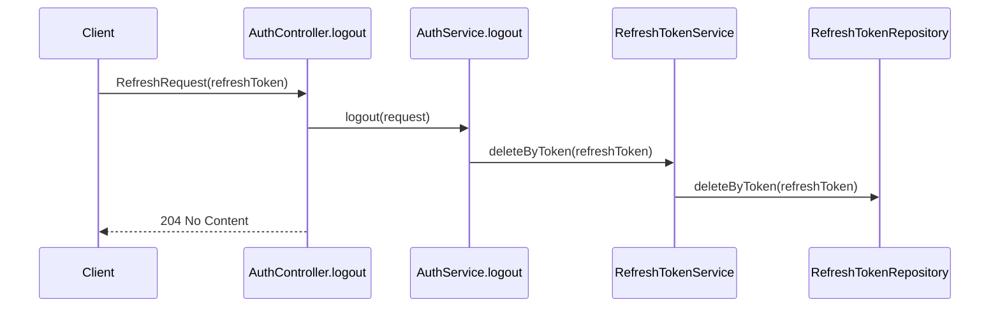
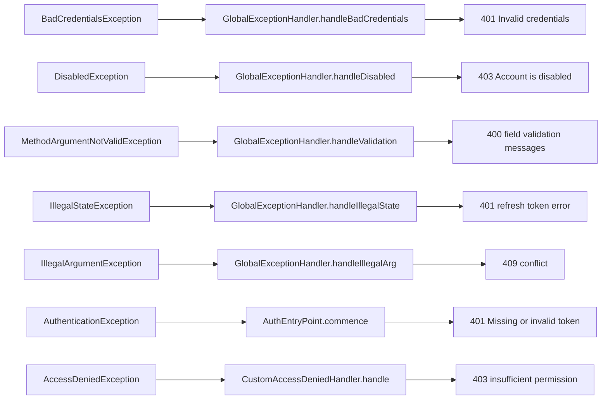

# Control Flow And Data Flow

## Application Startup Flow



## Registration Flow

Endpoint: `POST /api/auth/register`



Control notes:

- Request validation happens before controller logic because `RegisterRequest` is annotated and controller parameter uses `@Valid`.
- Duplicate emails are rejected before any password hashing or token creation.
- A successfully registered user is immediately logged in.

## Login Flow

Endpoint: `POST /api/auth/login`



Control notes:

- Credential checking is delegated to Spring Security.
- The method extracts the first authority from `UserDetails`; if none exists, it falls back to `ROLE_CUSTOMER`.
- Creating a refresh token invalidates any older refresh token for the same user.

## Access-Token Refresh Flow

Endpoint: `POST /api/auth/refresh`



Control notes:

- Refresh tokens are not JWTs; they are opaque UUIDs stored in the database.
- The refresh flow generates a new access token but returns the same refresh token.
- Expired refresh tokens are deleted as part of validation.

## Logout Flow

Endpoint: `POST /api/auth/logout`



Control notes:

- Logout invalidates the refresh token server-side.
- Existing JWT access tokens remain valid until their expiration because the app is stateless and does not maintain an access-token denylist.

## Protected Request Flow

This flow applies to any request that includes `Authorization: Bearer <token>`.

```mermaid
flowchart TD
    A[Incoming HTTP request] --> B[JwtFilter.doFilterInternal]
    B --> C{Authorization header exists and starts with Bearer?}
    C -- No --> D[Continue filter chain without authentication]
    C -- Yes --> E[Extract token after Bearer prefix]
    E --> F{jwtUtil.isValid(token)?}
    F -- No --> D
    F -- Yes --> G{SecurityContext authentication is empty?}
    G -- No --> K[Continue filter chain]
    G -- Yes --> H[jwtUtil.extractUsername(token)]
    H --> I[jwtUtil.extractRoles(token)]
    I --> J[Create UsernamePasswordAuthenticationToken]
    J --> L[Set web auth details]
    L --> M[Store auth in SecurityContextHolder]
    M --> K
    D --> N{Endpoint requires auth?}
    K --> N
    N -- Missing/invalid auth --> O[AuthEntryPoint returns 401 JSON]
    N -- Valid auth, insufficient role --> P[CustomAccessDeniedHandler returns 403 JSON]
    N -- Allowed --> Q[Controller/service executes]
```

Control notes:

- `JwtFilter` does not directly return a 401 for missing or invalid tokens.
- It leaves unauthenticated requests to continue; Spring Security later decides whether the target endpoint permits anonymous access.
- Roles are trusted from the signed JWT, so normal protected requests do not need a database lookup.

## Exception Response Flow



