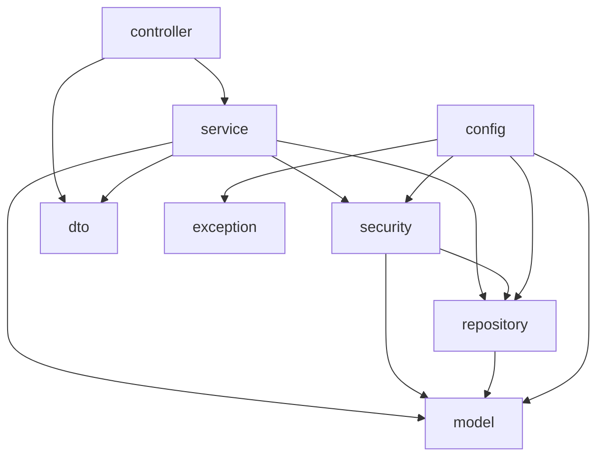
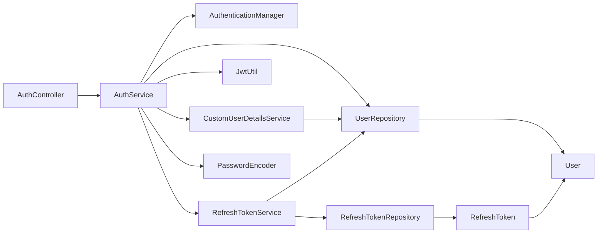
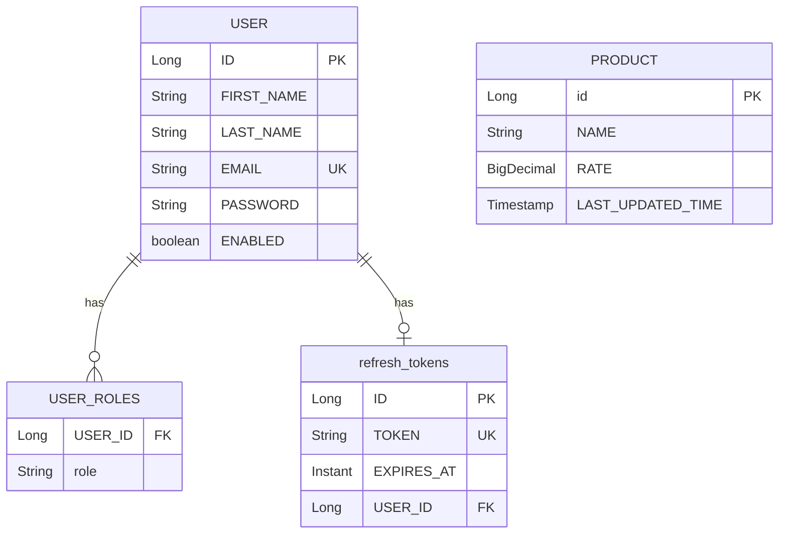
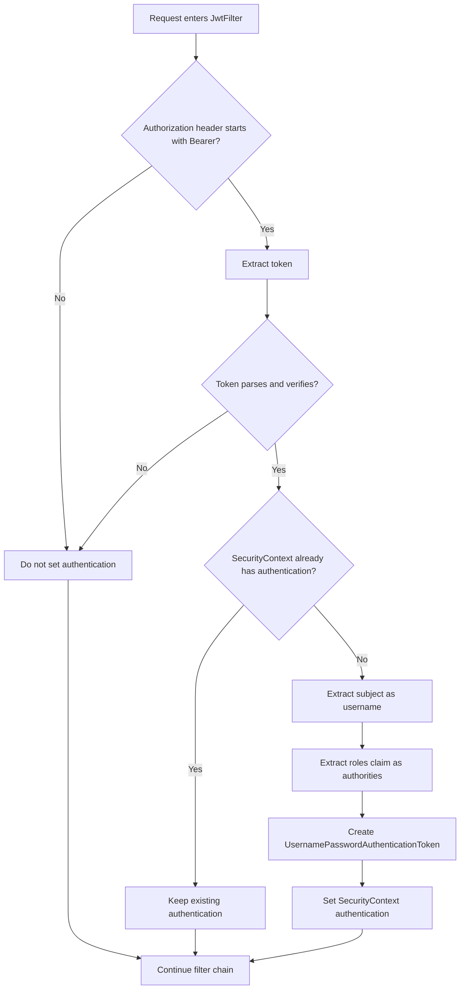
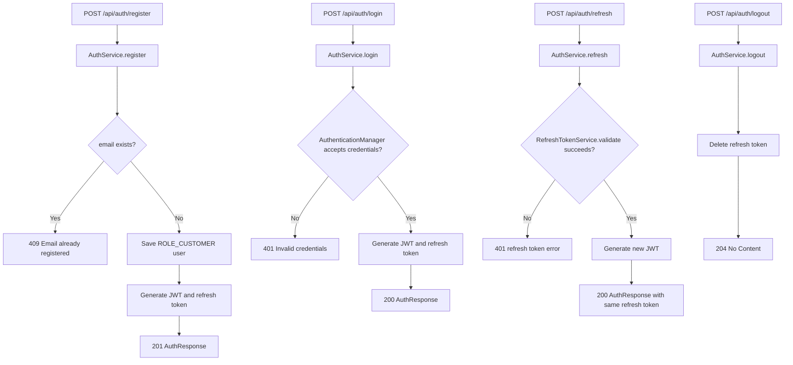
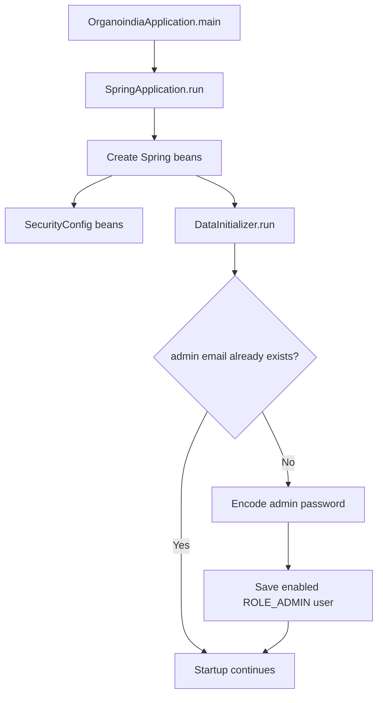

# Mermaid Diagrams

This file collects diagrams from the documentation in a standalone format.

## Package Dependency Overview

## Auth Controller To Persistence

## Entity Relationship Diagram

## JWT Filter Decision Tree

## Auth Endpoint Flows

## Startup Flow

